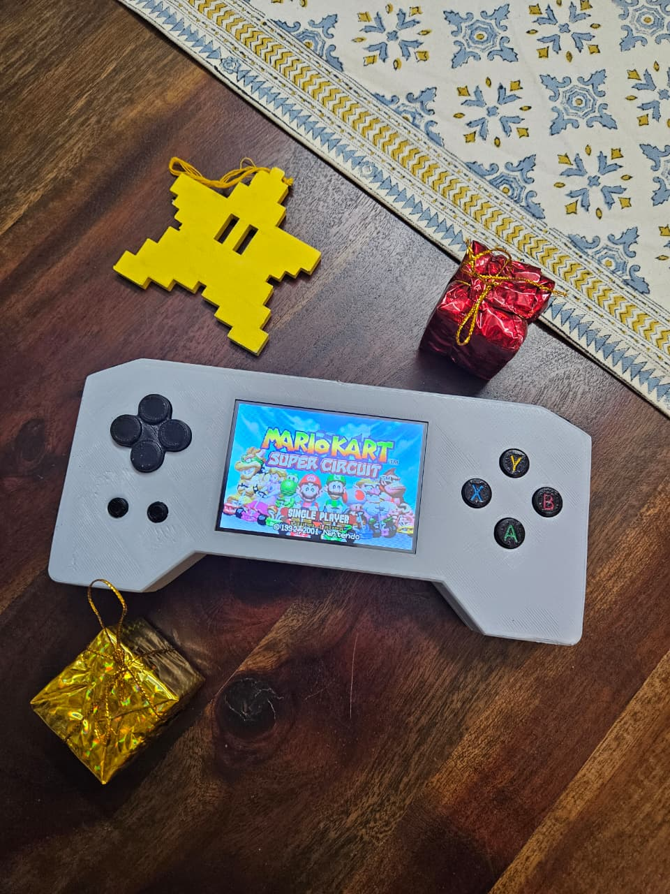

# Raspberry Pi Zero 2W GBA Handheld Build Guide

Ultimate **Game Boy Advanced style Handheld** using Pi Zero 2W + Retropie + Waveshare 3.5" Display + GPIO buttons + PWM audio. Perfect Pokémon/Game Boy Advance and upto PS1 emulation. Can copy ROMS on to the GBA over SMB (Shared Folder) and play.



## BOM (Bill of Materials) - ₹4575 = ~₹5000 Total (2025 price)

| Component | Model | Qty | Price (₹) | Source |
| --------- | ----- | --- | --------- | ------ |
| **Pi** | Raspberry Pi Zero 2 W with Header | 1 | 2054 | Robu.in |
| **Display** | Waveshare 3.5" TFT (A) | 1 | 790 | QuartzComponents.com |
| **Speaker** | SmartElex Digital Speaker Module 8Ω 0.5W | 1 | 267 | Robu.in |
| **microSD** | 16GB Class 10 | 1 | 300 | Amazon.in |
| **Buttons** | Tactile 12x12mm Switch | 12 | 60 | Robu.in |
| **Battery** | WLY103443 3.7V 1500mAh 1S LiPo Battery | 1 | 416 | Robu.in |
| **Batter Charger** | Seeed Studio Lipo Rider Plus (Charger/Booster) - 5V/2.4A USB Type C | 1 | 658 | Robu.in |
| **Slide Switch** | SS8-7-Small Slide Switch 2 way | 1 | 30 | Robu.in |
| **Case** | 3D printed GBA shell | 1 | - | Print @ home |
| **MSC** | Wires, Soldering, etc. | - | - | Robu.in |

## 1. 3D Printed Case

I have provided the CAD and STL files (/3D Model) , one can 3d print at home or order a printed case from any 3d print vendor.

## 2. Installing Retropie on the Raspberry Pi Zero 2 W

Download the latest retropie image from retropie.or.uk and install on the PI. Follow  the [instructions](https://retropie.org.uk/docs/First-Installation/).

The PI Zero 2 W has a mini HDMI port and needs a converter to connect to any monitor or TV. I did not have one so followed the below steps to install in a headless manner.

1. After the image is written on the the SD card connect he SD card to a computer.
2. Create the below two files in the root of the SD card.

     * Create an empty text file named 'ssh' without file extension. This will enable the SSH after the first boot.
     * Create a text file named 'wpa_supplicant.conf' and update your home WIFI details. This way PI will connect to the home network automatically.

     ``` text
     country=in
     update_config=1
     ctrl_interface=/var/run/wpa_supplicant
     
     network={
         scan_ssid=1
         ssid="your ssid"
         psk="your key"
         key_mgmt=WPA-PSK
    }
    ```

3. Unmount the SD card form your computer and insert it to the PI and boot.

Post installation the PI should connect to your home network with SSH enabled. Check the PI's IP from your home router and connect to the PI using any SSH client (I use PuTTY). The default user name and password are 'pi' an 'raspberry'.

Rest of the document use SSH for installation and configuration.

## 3. Display (Waveshare 3.5" TFT)

The 3.5" TFT display directly fits on the the raspberry pi GPIO header no soldering needed. Installing the driver is bit cumbersome as the [instructions](https://www.waveshare.com/wiki/3.5inch_RPi_LCD_(A)) are not well written. Pay attention to the raspberry pi model used and the version of operating system installed. Mine was a 'pi zero 2 w' and the OS was 'debian buster' hence I followed the below steps.

```  bash
git clone https://github.com/waveshare/LCD-show.git
cd LCD-show/
sudo ./LCD35-show

sudo reboot
```

Note: Unfortunately the command 'sudo ./LCD35-show' alters the '/boot/config.txt' in a way that is not desirable. Though the display might work but other configurations will be lost. Hence better to take a copy of the '/boot/config.txt' before and restore it after. The blow configuration is the only thing we need.

* Configure PI (Debian Buster) to use SPI instaed of HDMI as display with strps below.

    Edit '/boot/config.txt' (sudo nano /boot/config.txt)

    ``` text
    dtparam=spi=on
    dtoverlay=waveshare35a
    display_rotate=0  # Adjust 90/180/270 as needed

    #dtoverlay=vc4-kms-v3d
    #hdmi_force_hotplug=1
    #max_usb_current=1
    #hdmi_group=2
    #hdmi_mode=87
    #hdmi_cvt=480 320 60 6 0 0 0
    #hdmi_drive=2
    ```

* Comment out 'dtoverlay=vc4-kms-v3d' (if present)
* Comment out all configurations related to HDMI

After reboot the display should work.

## 4. Updating and Configuring Retropie

Update the Retropie, underlying OS and Packages using the below script. It may take two or more attempts. For me the first attempt gave some errors, mostly because the 'Debian Buster' is an old archived Raspbian version, but when I tried 2-3 times it updated fine.

``` bash
sudo ~/RetroPie-Setup/retropie_setup.sh
```

Enable Samba: This enables copying the ROMs and bios from your computer to the GBA over network share.

``` bash
sudo ~/RetroPie-Setup/retropie_setup.sh # Configuration/Tools > samba > Install and enable samba share

sudo reboot
```

## 5. GPIO Pin Configuration

Raspberry Pi GPIOs needs to be used for Display, Keys, PWM audio and power supply. There are 12 keys needed, one PWM audio, and 2 for power; all in all we need 15 pins in addition to the pins that the display TFT uses. Fom the display [documentation](https://www.waveshare.com/wiki/3.5inch_RPi_LCD_(A)) we find that the display header occupies 1-28 physical pins of the PI but the pins '3,5,7,8,10,12,13,15,16' are not used, hence they can be used. We would use the pin 2 and 6 to supply power to the PI.

We will use the below pins for the purpose mentioned.

**GBA GPIO Button Wiring Table:**

| GBA Button    | Physical Pin | BCM GPIO |
| ------------- | ------------ | -------- |
| **UP**        | 3            | GPIO 2   |
| **DOWN**      | 5            | GPIO 3   |
| **LEFT**      | 7            | GPIO 4   |
| **RIGHT**     | 8            | GPIO 14  |
| **A**         | 10           | GPIO 15  |
| **B**         | 13           | GPIO 27  |
| **X**         | 15           | GPIO 22  |
| **Y**         | 16           | GPIO 23  |
| **SELECT**    | 29           | GPIO 5   |
| **START**     | 31           | GPIO 6   |
| **L Trigger** | 35           | GPIO 19  |
| **R Trigger** | 40           | GPIO 21  |
| **Key GND**   | 30           | -        |
| **PWM Audio** | 32           | GPIO 12  |
| **VCC**       | 2            | +5V      |
| **GND**       | 6            | -        |


The pin 8 and 10 (GPIO 14 and GPIO 15) are default UART pins hence to use them as INPUT pins we have to disable the UART in config .txt.

Edit '/boot/config.txt' (sudo nano /boot/config.txt)

``` text
# Uncomment some or all of these to enable the optional hardware interfaces
#dtparam=i2c_arm=on
#dtparam=i2s=on
#enable_uart=1
# Uncomment this to enable the lirc-rpi module
#dtoverlay=lirc-rpi
```

Basically disable\comment all other optional hardware interfaces.

**Wiring Diagram (Active LOW):**

Pull-Down (External Resistor):

``` text
Pin 1 (3.3V)
   |
   +----[BUTTON]----+  ← Press here
   |                |
   |              GPIO2 (Pin 3)
   |                |
   +----[10kΩ]------+
                    |
                Pin 30 (GND)
```

Pull-Up (Internal - No Resistor): <- I used this in my build

``` text
GPIO2 (Pin 3) ─────[BUTTON]──── Pin 30 (GND)
     ↑
Internal 50kΩ Pull-up (enabled in software)
```

I found that the internal pull-up resistors of the PI are good enough, using an external pull-down resistor is optional.

Install the 'raspi-gpio' utility and use command 'sudo raspi-gpio get' to check if all the gpio pins have the right configuration.

**Configuring the GPIO Controller:**

In order to provide a controller interface to RetroPie we would need a GPIO controller and that would be GPIONext.
Install and configure GPIOnext as per below steps.

``` bash
# Update system
sudo apt update && sudo apt full-upgrade -y
sudo apt install python3-pip git -y

# Install evdev (required for joystick emulation)
sudo pip3 install evdev

# Clone and install GPIOnext
cd ~
git clone https://github.com/mholgatem/GPIOnext.git
cd GPIOnext
sudo bash install.sh

# Configure GPIOnext for your GBA buttons
gpionext config
```

``` text
# During gpionext config:
Joypad 1 → Select (1)
D-Pad → 1
Buttons → 8

# Map your exact pins (BCM numbers):
Up: GPIO 2 (Pin 3)
Down: GPIO 3 (Pin 5)  
Left: GPIO 4 (Pin 7)
...

# Press buttons when prompted → Save → Exit
gpionext start
```

This should work. When the 'Emulation Station starts' it should detect 1 gamepad and you can map the keys in ES.

## 6. PWM Audio Configuration

Configure the Pin 32 and 33 (GPIO 12 & 13) as the PWM OUT. The 'SmartElex Digital Speaker Module' used in the build alredy has a RC filter to filter the PWM signal hence we do not have to build a separate RC filter.

Edit '/boot/config.txt' (sudo nano /boot/config.txt)

``` text
# Enable audio (loads snd_bcm2835)
dtparam=audio=on
audion_pwm_mode=2
dtoverlay=audremap,pins_12_13
```

Use the below commands to check for audio

``` bash
# List available devices
aplay -l
# Look for: card 0: Headphones [bcm2835 Headphones]

# Test device
aplay -D default /usr/share/sounds/alsa/Front_Center.wav

# Check mixer levels
alsamixer  # Unmute PCM/Master (↑ arrows)  # PCM → 90%, Master → 80%
```

## 7. Performance Optimizations

The default Retropie configuration do not give proper performance for games and keeps on hanging on the Raspberry Pi Zero 2 W. We need to tweak some configurations to make it performant and stable.

* Use a >2A power source and connect the power source and Raspberry Pi using a good enough gauge wire to ensure PI not browning out under load. The chosen 'Seeed Studio Lipo Rider Plus (Charger/Booster)' is good for the build.
* Limit the resolution for stable performance. The frame buffer for the SPI display is the biggest performance killer. Use below configuration to mimize the load.

    ``` text
    #'/boot/config.txt' ->

    # Display
    #dtoverlay=vc4-fkms-v3d
    dtparam=spi=on
    dtoverlay=waveshare35a
    framebuffer_width=320  # Limit resolution
    framebuffer_height=240 # Limit resolution
    dtoverlay=spi0-1cs     # Enable only one SPI device
    hdmi_blanking=2        # Blank out the HDMI
    ```

* Select a theme that is suitable for the display size. I found the **'TFT'** theme to be the best.

    Install Theme:

    ``` text
    sudo ~/RetroPie-Setup/retropie_setup.sh
    → Configuration/Tools → esthemes → Install from binary/theme gallery
    → View gallery → Select theme → Install

    ```

    Apply Theme:

    ``` text
    Start → UI Settings → Theme Set → [Your theme name] (e.g. -> TFT)

    ```

* Use lightweight emulators and drivers

    Lightweight core config:

    ``` bash
    sudo nano ~/.config/retroarch/retroarch.cfg

    # Global Config
    menu_driver = "rgui"
    video_driver = "dispmanx"

    menu_enable_widgets = "false"
    menu_show_advanced_settings = "false"

    video_scale = "1.0"
    video_smooth = "false"
    video_shader_enable = "false"
    video_filter = ""
    input_overlay_enable = "false"

    audio_driver = "alsa"

    sudo reboot
    ```

    Configure lightweight emulators:

    ``` bash

    sudo nano /opt/retropie/configs/nes/emulators.cfg

    default = "lr-fceumm"

    sudo nano /opt/retropie/configs/snes/emulators.cfg

    default = "lr-snes9x2002"

    sudo nano /opt/retropie/configs/gba/emulators.cfg

    default = "lr-gpsp"

    sudo nano /opt/retropie/configs/psx/emulators.cfg

    default = "pcsx-rearmed"

    sudo reboot
    ```

You can refer the config file of my build **(/Config/)**.

The only work left is to do the soldering and wiring and fitting work. Refer the images of my build and wiring **(/Doc/img/)**.

**!!Congratulations!! !!You should be good to go. Happy Gaming!!**
